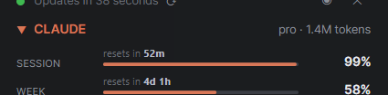
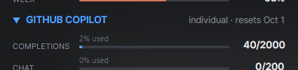
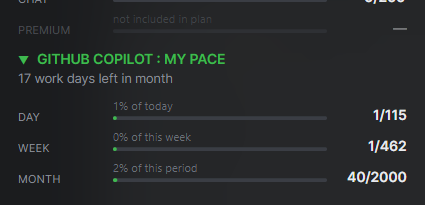

# Token Burn Rate

A small always-on-top application that shows your live **Claude** and **GitHub Copilot**
usage, so you always know how much you have left.

## Install

1. Go to the [latest release](https://github.com/HovKlan-DH/Token-Burn-Rate/releases/latest)
   and download the installer for your system:

   | System | File |
   | --- | --- |
   | Windows | `Token-Burn-Rate-win-Setup.exe` |
   | macOS (Apple Silicon) | `Token-Burn-Rate-osx-arm64-Setup.pkg` |
   | macOS (Intel) | `Token-Burn-Rate-osx-x64-Setup.pkg` |
   | Linux | `Token-Burn-Rate.AppImage` |

2. Run it and follow the installer. No admin rights are needed.

   - **Windows** installers are code-signed, but may still briefly show a blue "Windows
     protected your PC" screen until the signature builds up reputation with Microsoft. If
     so, click **More info**, then **Run anyway**.
   - **macOS** is not signed and will block the first launch as coming from an unidentified
     developer. Right-click the application, choose **Open**, then confirm.

3. The application opens automatically and stays on top of your other windows.

That's it - updates after this happen by themselves in the background.

## Sign in

### Claude

Click the Claude panel and choose **Sign in to Claude**. A browser window opens on
claude.ai; approve it there, then copy the code it shows you back into the application and
click **Sign in**.

This is a one-time step. The application keeps you signed in after that.

### GitHub Copilot

Click **Sign in to GitHub** in the Copilot panel. The application shows a short code and
opens GitHub's device sign-in page - enter the code there and approve.

If you're already signed in to the GitHub CLI on your computer, this panel works right away
with no extra steps.

## What you see

### Claude

Your **session** and **weekly** usage, each with a bar and a countdown to when it resets.
These are the exact same numbers shown on the Usage page at claude.ai.

### GitHub Copilot

Your monthly **completions**, **chat**, and **premium request** usage. Anything not included
in your plan is shown greyed out; anything unlimited shows as ∞.

### My Pace

A daily budget for your Copilot usage: how much you've used **today**, **this week**, and
**this month**, against a fair daily allowance calculated from what's left in the period. Go
over 100% and the number keeps counting, so you can see by how much.

## Everyday use

- **Move it** - drag the top bar anywhere on screen; it reopens there next time.
- **Refresh now** - click the small circular arrow, top right.
- **Pin on top** - the pin icon toggles whether the application stays above other windows.
- **Close to tray** - closing the application keeps it running quietly in the background;
  click its icon in the system tray to bring it back.
- **Right-click** the application for more options - show or hide individual panels, change
  colors and text size, and other preferences.

If a panel you're not signed in to isn't shown, that's expected - it appears as soon as you
sign in.

## Information for IT organizations

- No administrator rights are required to install or run - it installs per-user.
- Silent/unattended install is supported: run the Windows installer with `--silent`.
- Installs to the current user's local application data folder, not `Program Files`.
- Self-updates automatically from GitHub Releases; this can be turned off manually per machine (by the user) from
  the right-click menu (Advanced → Auto-update to newest version).
- The Windows installer and executable are code-signed (YubiKey-backed certificate); a
  SmartScreen warning, if any, is reputation-based and temporary, not a sign of tampering.
- macOS builds are not signed or notarized and require a right-click **Open** to bypass
  Gatekeeper.
- Outbound HTTPS only, to: `api.anthropic.com` (Claude usage), `api.github.com` and
  `github.com` (Copilot usage and sign-in), and `mailscan.dk` (a version/OS check-in from
  the developer, no usage data).
- Reads only usage figures already visible to the signed-in user on claude.ai and
  github.com - no code, prompts, or repository content is ever accessed.
- Each user signs in individually with their own Claude and GitHub account; there is no
  shared or service account, and no credentials are centrally managed.
- Sign-in tokens are stored locally per user (`%LocalAppData%` on Windows), encrypted at
  rest on Windows and owner-only readable elsewhere.
- Registers a per-user autostart entry (`HKCU` on Windows) if left enabled; never writes to
  machine-wide (`HKLM`) locations.
- Open source: [github.com/HovKlan-DH/Token-Burn-Rate](https://github.com/HovKlan-DH/Token-Burn-Rate).
