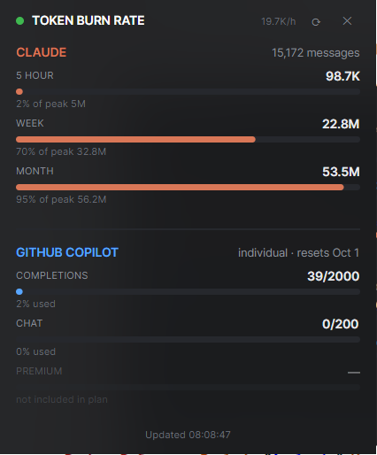

# Token Burn Rate

A small always-on-top desktop widget showing live AI usage for **Claude Code** and
**GitHub Copilot**, as a single portable executable for Windows, Linux and macOS.



## What it shows

### Claude — 5 hour / week / month
Read from Claude Code's local transcripts (`~/.claude/projects/**/*.jsonl`). Every
assistant message records exact token usage, so these are real numbers, computed offline
with no API call and no credentials.

The **5 hour** window is first on purpose: Claude Code enforces a rolling 5-hour session
limit, so that is the bar that predicts an actual cutoff. A calendar "today" bar would not.

Bars show `input + output + cache-creation` tokens. Cache *reads* are excluded from the
headline figure — they are billed at a fraction of the input rate and run ~100x larger than
everything else, so including them would flatten the bars into noise.

### GitHub Copilot — completions / chat / premium
Read live from GitHub's `copilot_internal/user` endpoint, authenticated with the token from
your existing `gh` CLI login. These are **monthly** quotas that reset on a fixed date.

Copilot deliberately does *not* get today/week/month bars: the endpoint returns only a
point-in-time snapshot, and nothing on disk records history, so shorter windows cannot be
derived. A quota not included in your plan (e.g. premium interactions on the free tier) is
shown dimmed rather than as a misleading empty bar, and an unlimited bucket shows as ∞.

The panel adapts to whichever account the machine is signed in to, with no configuration:

| | Personal account | Org-assigned (business / enterprise) |
| --- | --- | --- |
| Subtitle | plan tier | `org-name · plan tier` |
| Completions / Chat | quota bars | often unlimited, shown as ∞ |
| Premium interactions | dimmed, not in plan | real bar (e.g. 177/300) |

### Why there is no Microsoft 365 Copilot panel

M365 Copilot (Word, Excel, Outlook, Teams) is a **different product** from GitHub Copilot
with a **separate pool** — prompts spent in Office do not touch the GitHub Copilot quota.
It is deliberately not shown here, because its usage is not readable from a user's machine:

- The only programmatic source is Microsoft Graph's `getMicrosoft365CopilotUsageUserDetail`,
  which requires `Reports.Read.All` **plus a tenant admin role** (Reports Reader, AI
  Administrator, Company Administrator, …). It returns tenant-wide data about every user,
  which is why it is gated.
- It reports **no quota at all** — only per-app last-activity dates, and prompt counts in
  v2. There is no entitlement or remaining balance to draw a bar against.
- It is a daily-refreshed adoption report, not a live counter.

Enterprise M365 Copilot is also typically a flat licensed seat rather than a metered pool,
so for most work tenants there is no "remaining" figure that would even be meaningful.

## Bar denominators

Anthropic publishes no per-plan token ceiling, so Claude's bars auto-calibrate: the heaviest
window of that size ever seen in your history becomes 100%. Each bar reads "how heavy is
this window against my own record", and adjusts as your habits change. Copilot's bars use
the real entitlement reported by GitHub.

## Requirements

- **Claude panel** — Claude Code installed, with transcripts in `~/.claude/projects`.
  Honours `CLAUDE_CONFIG_DIR`.
- **Copilot panel** — [GitHub CLI](https://cli.github.com/) installed and authenticated
  (`gh auth login`). `GH_TOKEN` / `GITHUB_TOKEN` are used first if set. Works with personal
  and org-assigned seats alike; the same binary adapts to whichever it finds.

Each panel degrades independently: if one source is unavailable the other still works, and
the reason is shown in place of the bars.

## Build

```bash
./build-all.sh            # all four targets
```

or one platform:

```bash
dotnet publish Token-Burn-Rate.csproj -c Release -r win-x64 -o publish/win-x64
```

Targets: `win-x64`, `linux-x64`, `osx-arm64`, `osx-x64`. Output is one self-contained
executable (~48 MB) needing no .NET install on the target machine.

Trimming is intentionally disabled — Avalonia resolves XAML types by reflection, and
trimming breaks that only in published builds, where it is hardest to diagnose.

### macOS / Linux notes

The published binary needs the executable bit after transfer:

```bash
chmod +x TokenBurnRate
```

macOS builds are unsigned, so Gatekeeper quarantines them on first run:

```bash
xattr -d com.apple.quarantine TokenBurnRate
```

## Usage

Drag the header to move; position is remembered between runs. `⟳` refreshes immediately,
`✕` closes. It refreshes on its own every 60 seconds.

Claude's transcripts total hundreds of MB, but only ~0.1% changes per day, so files are
parsed incrementally from a byte offset: the first read takes ~2.8s and every refresh after
that ~13ms.
